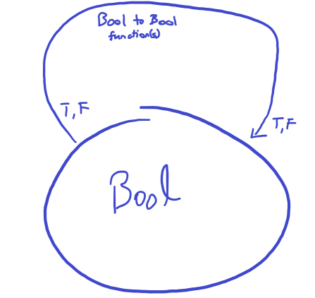

# Challenges
1. Define a higher-order function (or a function object) memoize in
your favorite language. This function takes a pure function f as
an argument and returns a function that behaves almost exactly
like f, except that it only calls the original function once for every
argument, stores the result internally, and subsequently returns
this stored result every time it’s called with the same argument.
You can tell the memoized function from the original by watch-
ing its performance. For instance, try to memoize a function that
takes a long time to evaluate. You’ll have to wait for the result
the first time you call it, but on subsequent calls, with the same
argument, you should get the result immediately. 
-- [Code](./test_memoize_pure_function.py)
2. Try to memoize a function from your standard library that you
normally use to produce random numbers. Does it work?  
-- [Code](./test_memoize_pure_function.py)
3. Most random number generators can be initialized with a seed.
Implement a function that takes a seed, calls the random number
generator with that seed, and returns the result. Memoize that
function. Does it work? -- [Code](./test_memoize_pure_function.py)
4. Which of these C++ functions are pure? Try to memoize them
and observe what happens when you call them multiple times:
memoized and not. -- [Code](./test_memoize_pure_function.py)
5. How many different functions are there from Bool to Bool? Can
you implement them all? -- Assuming we aren't considering bottoms,
these are the different functions when we go from Bool to Bool
(consider the below illustration of what Bool to Bool means)

Bool to Bool #1: T -> F, F -> F -- x => F, constant false function
Bool to Bool #2: T -> T, T -> T -- x => T, constant true function
Bool to Bool #3: T -> F, F -> T -- x => not x, negation function
Bool to Bool #4: T -> T, F -> F -- x => x, the identity function
There are four.
6. 