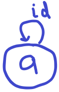
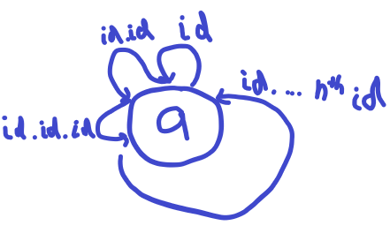
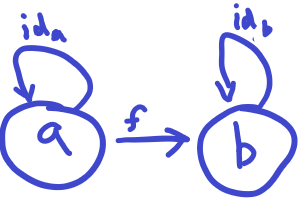
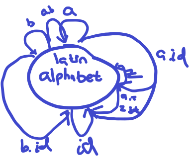
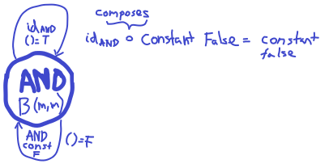
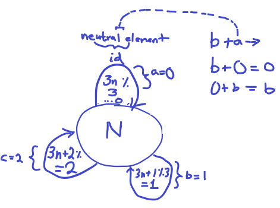

1. Generate a free category from:

    (a) A graph with one node and no edges
         Can just be the object without an identity.

    (b) A graph with one node and one (directed) edge (hint: this
        edge can be composed with itself)
        
    
    (c) A graph with two nodes and a single arrow between them
        

    (d) A graph with a single node and 26 arrows marked with the
        letters of the alphabet: a, b, c … z.
         Explanation: a composes to b forming a.b, id composes to id.id and also a.id composes to id and 
        a.b. ... z.id also composes to id. Infinitely many edges from each morphism to each morphism.
        The hom set is (injective?) surjective to itself.
2. What kind of order is this?
     (a) A set of sets with the inclusion relation: 𝐴 is included in 𝐵
         if every element of 𝐴 is also an element of 𝐵.
         Answer -- This is a total order. A has a morphism with B and B has a morphism with A
         for any two combination of sets A & B in the set of sets. A has a morphism with all
         sets, for all A in the set of sets.
     (b) C++ types with the following subtyping relation: T1 is a sub-type
         of T2 if a pointer to T1 can be passed to a function that
         expects a pointer to T2 without triggering a compilation error.
         Answer -- This is a demonstration of inheritance. This relation demonstrates a
         (preorder?) partial order/thin category unless the same applies for a function that expects a T1, but T2
         can be passed instead of T1 without a compilation error, in which case is a total order. C(T1,T2) = C(T2,T1)
3. Considering that Bool is a set of two values True and False, show 
     that it forms two (set-theoretical) monoids with respect to, respectively, operator && (AND) 
     and || (OR).
     Answer -- (a && b) && c == a && (b && c) due to the fact that boolean && is associative. 
     Boolean && is associative: Consider the following equation which demonstrates AND, a && (b && c) = (a && b) && c
     () has a neutral element such that a && () = a as well as () && a = a, the neutral element forms an 
     identity function. The () here is TRUE. For the OR operation, we have a similar a || (b || c) = (a || b) || c. 
     Consider another () which represents the neutral element such that a || () = a as well as () || a = a. The
     value of neutral element () is FALSE. a && TRUE = a, TRUE && a = a (regardless of whether a is T/F).
     a || FALSE = a, FALSE || a = a (regardless of whether a is T/F). Demonstrating associativiy.

4. Represent the Bool monoid with the AND operator as a category:
     List the morphisms and their rules of composition.
     Answer -- 
5. Represent addition modulo 3 as a monoid category.
     Answer --  Demonstrates the category. Do we need to prove associativity, composition,
     and identity?