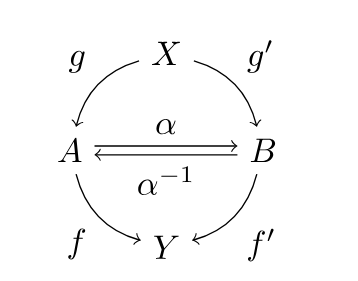
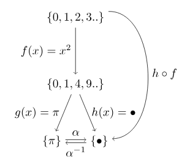
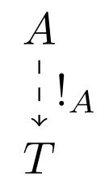
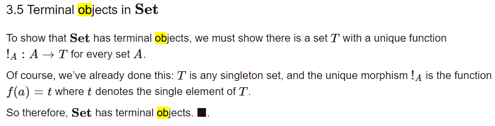

# Chapter 5
### Question 1
We prove isomorphism for this graph.

Consider the above category which I re-describe in mathematical notation below.

For an initial object, X there exists g and g' such that g: X -> A, g': X -> B.

Further there exists a terminal object Y such that we have the morphisms, f: A -> Y, f': B -> Y

And an isomorphism between A and B such that, α: A -> B, and α^-1: B -> A. A is isomorphic to B and vice versa

Graphically, there is a "unique shape" easily seen which describes the unique isomorphism, let's prove it
mathematically.

Let us denote bijectivity from A to B with the following phi symbol 'ϕ' and Hom-set notation

ϕ: 𝒞(A, Y) -> 𝒞(B, Y)

𝒞 denotes the hom-set from object to object.

Next, let's prove and construct ϕ and ϕ^-1 and that ϕ^-1 ○ ϕ = id

ϕ: 𝒞(A, Y) -> 𝒞(B, Y) which is also rewritten into

ϕ(f) = f ○ α^-1

We can describe the inverse in a similar way,

ϕ^-1: 𝒞(B, Y) -> 𝒞(A, Y)

ϕ^-1(f') = f' ○ α

Now to prove the inverse ϕ^-1 by showing these two phi and inverse phi combined form identity,

ϕ^-1 ○ ϕ = id_a = 𝒞(A, Y) -> 𝒞(A, Y) (Prove this)

(ϕ^-1 ○ ϕ) (f) = (ϕ^-1)(ϕ(f))

= (ϕ^-1)(f ○ α^-1), changing the right group from the previous definition ϕ(f) = f ○ α^-1

ϕ^-1(f') = f' ○ α

We can substitute f' which is equivalent to f ○ α^-1 which is saying to take morphism f in 𝒞(A, Y)

Alternatively, you can describe that f' is a morphism which is equivalent to f but only under the isomorphism.

= f ○ α^-1 ○ α

Remember, α is equivalent to 𝒞(A, Y) whereas α^-1 is equivalent to 𝒞(B, Y)

hence it results in an identity.

= f ○ id_A

= f

This describes isomorphism as a bijection between two morphisms, and further and subsequent morphisms.

Now, we need to describe isomorphisms up to unique isomorphisms, which we can do by describing what a
terminal object is.

Here is an example which includes a category that contains objects from Set:

Given this category 𝒞, we say an object T is terminal if for all objects A∈ob(𝒞) there exists a unique morphism:

!A: A -> T

By extension, since this is a category, T has an identity id_T

And now to prove that for any arbitrary category with any amount of terminal objects, the terminal objects are
unique up to unique isomorphism (since a terminal object is simply a singleton set with a unique morphism to
it as explained from before.)

Intuitively, from this graph, we can describe as isomorphism between T and T' with the following
composition:

!T ○ !T' = id_B and !T' ○ !T = id_A, an isomorphism. 

This shows any two unique isomorphic morphisms are indeed unique since their order describes a different unique identity
BUT that for any isomorphism relationship, there is only one isomorphism here which describes the singular unique
isomorphism between T and T', despite there being two unique isomorphic relations.

### Question 2
What is a product of two objects in a poset? Hint: Use the universal construction.

So consider a poset or a category 'P'. We have a, b, p in P such that 'p' is a product of two objects.
A product of a and b is denoted with the following: pi_a: p -> a, pi_b: p -> b.
And we have an object x which has morphisms h: x -> p and f: x -> a g: x -> b. H is a unique
morphism such that f: pi_a after h and g: pi_b after h.

### Question 3
What is a coproduct of two objects in a poset?

Conversely, a coproduct for a category 'P' would used the same elements but reverse the directions
of morphisms. We have a, b, p in P such that 'co_p' is the coproduct of the two objects.
A coproduct is denoted by incl_a: a -> p and incl_b: b -> p. We have an object x once again where
f: a -> x and g: b -> x. We also have a morphism such that h: co_p -> x and f = h after incl_a 
and g = h after incl_b.

### Question 4
